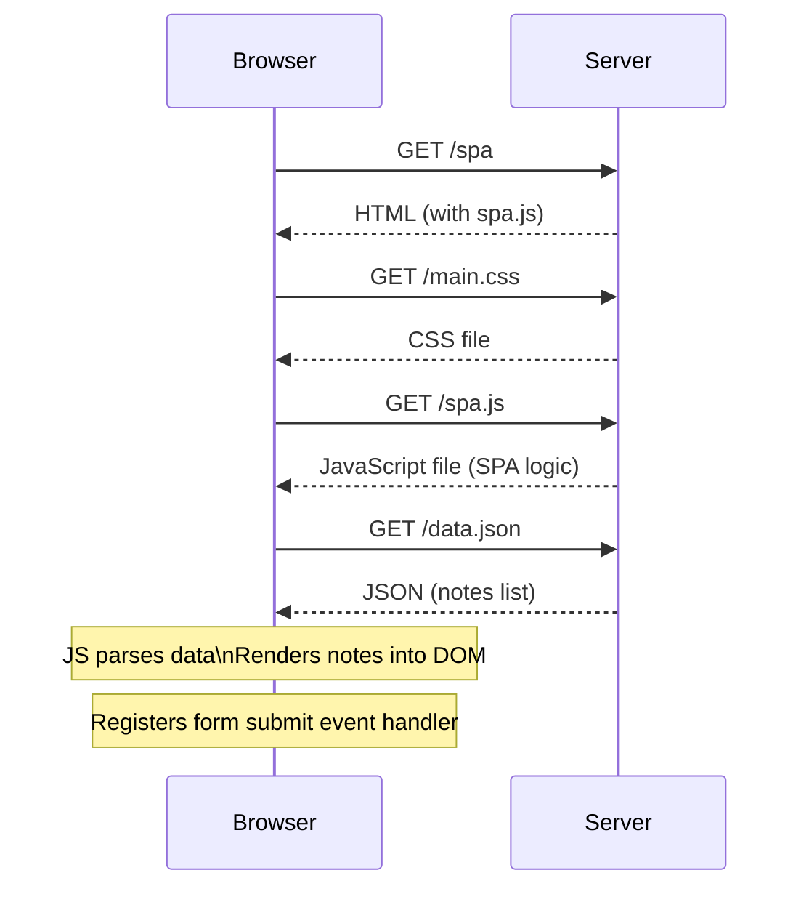

```mermaid
sequenceDiagram
    participant Browser
    participant Server

    Browser->>Server: GET /spa
    Server-->>Browser: HTML (with spa.js)

    Browser->>Server: GET /main.css
    Server-->>Browser: CSS file

    Browser->>Server: GET /spa.js
    Server-->>Browser: JavaScript file (SPA logic)

    Browser->>Server: GET /data.json
    Server-->>Browser: JSON (notes list)

    Note over Browser: JS parses data\nRenders notes into DOM
    Note over Browser: Registers form submit event handler
```