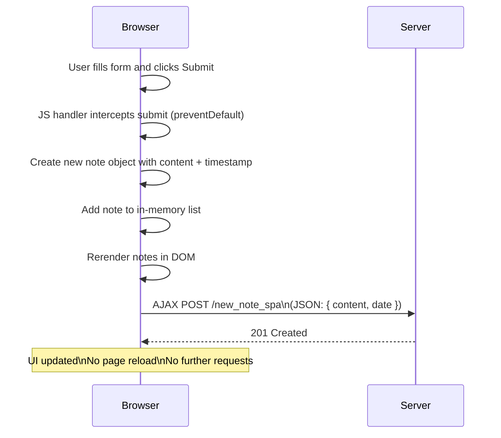

```mermaid
sequenceDiagram
    participant Browser
    participant Server

    Browser->>Browser: User fills form and clicks Submit
    Browser->>Browser: JS handler intercepts submit (preventDefault)
    Browser->>Browser: Create new note object with content + timestamp
    Browser->>Browser: Add note to in-memory list
    Browser->>Browser: Rerender notes in DOM

    Browser->>Server: AJAX POST /new_note_spa\n(JSON: { content, date })
    Server-->>Browser: 201 Created

    Note over Browser: UI updated\nNo page reload\nNo further requests
```